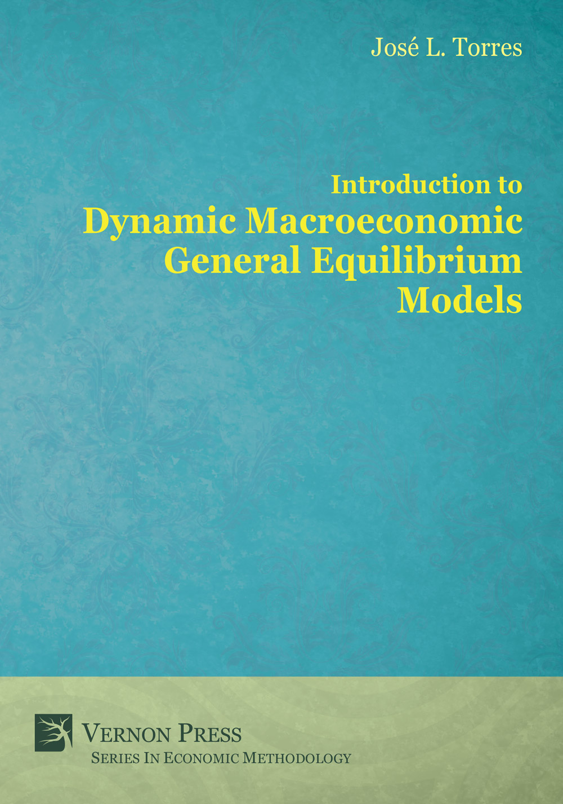
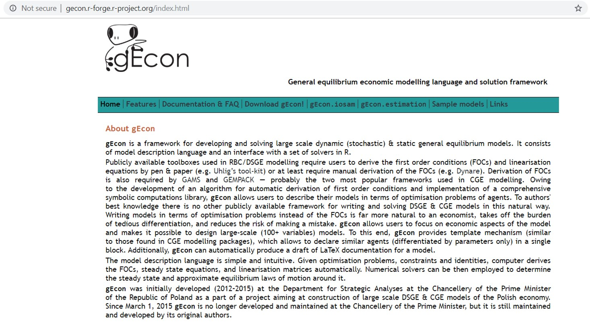

## Today's class <br/><br/>

<br /> 

- Course Logistics <br/><br/>
- Evaluation <br/><br/>
- Assignment 1

## Course Logistics <br/><br/>

 - **Canvas** is our communication platform <br/><br/>
 - All assignments are submitted through Canvas <br/><br/>
 - All questions are posted on Canvas

```{r, out.width='50%', fig.align='center', echo=FALSE}
 
```
 
## Key Aspects
<br /> 
<br /> 

<br /> 

  Arrive on time. Once the class starts, you need to wait until the  break to get it <br/><br/>
  _We will work on class solving the problems._
  
<br /> 
  
  **Come prepared!**

## Evaluation
<br /> 
<br /> 

<br /> 

-- Total Assignments | 100%
---------------------- | ----------------------
Weekly reading control | 20%
Weekly random assignments  | 20%
Final paper            | 30%
Exam                   | 30%


## Textbook
```{r, out.width='50%', fig.align='center', echo=FALSE}
 
 ```
 
## Modeling software 
```{r, out.width='90%', fig.align='center', echo=FALSE}
 
 ```

## Course schedule-Part 1-
<br /> 
<br /> 
   
Part 1  | Session                       | Chapter
------- | ----------------------------  | --------------
Week 1  | Review, motivation and set up | 
Week 2  | Introduction to DSGE Modeling | Chapter 1 (Torres)
Week 3  | The Canonical Model           | Chapter 2 (Torres)
Week 4  | The Canonical Model           | Chapter 2 (Torres)
 

## Course schedule-Part 2-
<br /> 
<br /> 

Part 2 | Session | Chapter
------- | ----------------------------  | --------------
Week 5  | Habit Formation  | Chapter 3 (Torres)
Week 6  | Habit Formation  | Chapter 3 (Torres)
Week 7  | Non-Ricardian Agents          | Chapter 4 (Torres)
Week 8  | Non-Ricardian Agents           | Chapter 4 (Torres)


## Course schedule-Part 3-
<br /> 
<br /> 

Part 3 | Session | Chapter
------- | ----------------------------  | --------------
Week 9  | Investment Adjustments Costs  | Chapter 5 (Torres)
Week 10  | Investment Adjustments Costs  | Chapter 5 (Torres)
Week 11  | Investment-specific technological change          | Chapter 6 (Torres)
Week 12  | Investment-specific technological change           | Chapter 6 (Torres)


## Course schedule-Part 4-
<br /> 
<br /> 
  
Part 4 | Session | Chapter
------- | ----------------------------  | --------------
Week 13  | Taxes  | Chapter 7 (Torres)
Week 14  | Taxes  | Chapter 7 (Torres)
Week 15  | Public Spending  | Chapter 8 (Torres)
Week 16  | Public Spending  | Chapter 8 (Torres)
Week 17  | Public Capital  | Chapter 9 (Torres)
Week 18  | Exam, Paper Due | 


## For next class 
<br /> 

- Readings:
  1. Torres, Chapter 1
  2. Lucas, R. (1976): *Econometric Policy Evaluation: A Critique*
  3. Owner: random

<br /> 

- Problem Set:
  1. Download gEcon: http://gecon.r-forge.r-project.org/
  2. Come ready to work with it
  3. Owner: Víctor
  
  <br /> 
- Other Sources <br /> 
  Video: https://youtu.be/4CajbmZdwpM
  <br /> 
  <br /> 
