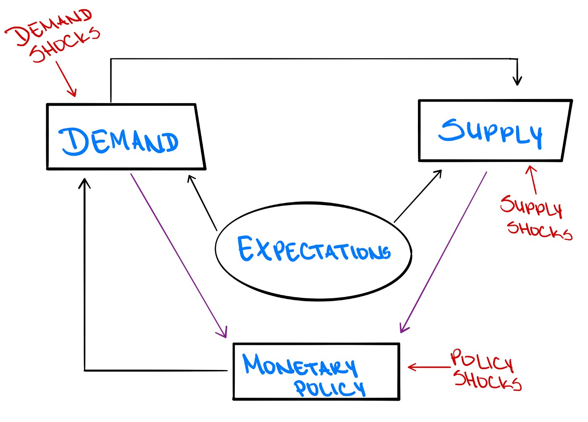
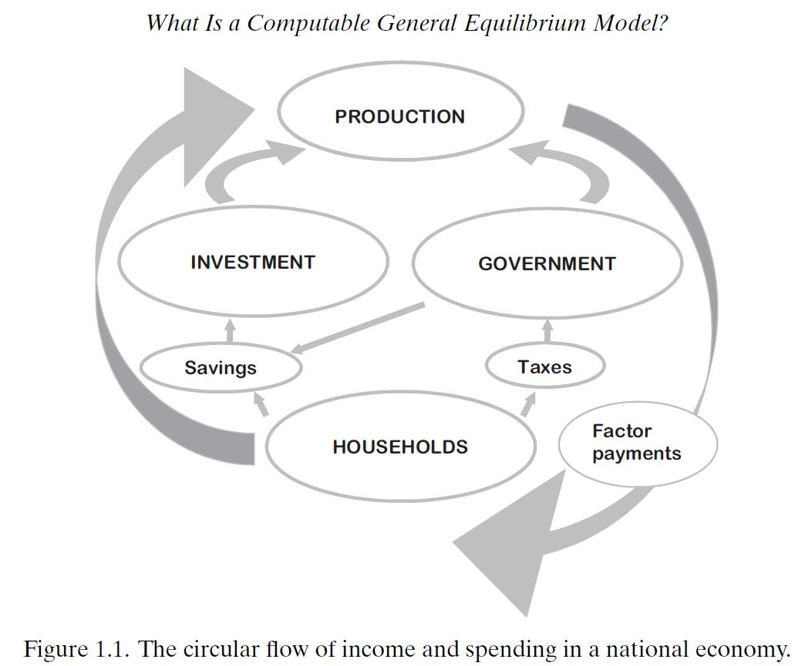
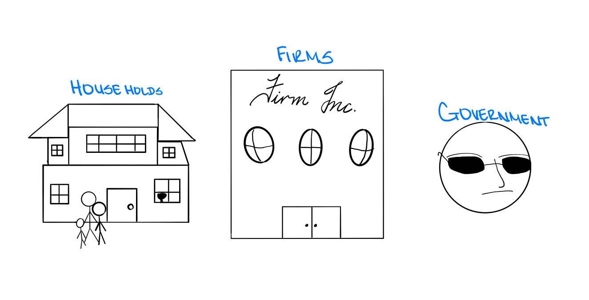
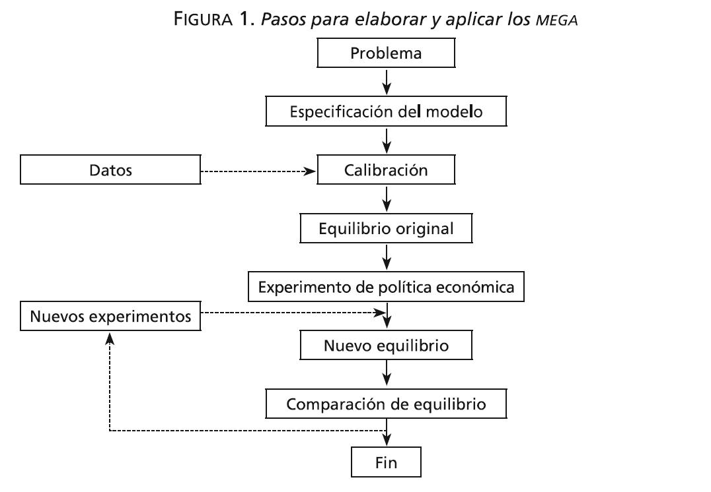

## Today's class

<br /> 

 - DGSE Models
 <br /> 
 <br /> 
 - Lucas' Critique

## Dynamic General Stochastic Equilibrium Models (DGSE)
<br /> 

- Important *tool* for current macroeconomic analysis.
- Help us understand how an economy as a whole responds to *shocks*.
- DGSE models are a *“macroeconomic laboratory”* which can be used to study how agents respond to their environment using micro-foundations
- Under DGSE all endogenous variables are determined *simultaneously*.
- Modern macroeconomic analysis concerned with the *construction/calibration/and estimation* of DGSE models.

## Shortcomings
- Since, the focus in on macro behavior, the need to be aggregated (i.e., production function)
- Assumptions about reality need to be simplistic:
- Rational expectations
- Forward looking behavior
- Are these problematic?

```{r, out.width='50%', fig.align='center', echo=FALSE}
 
```

## DSGE framework attempts to address two main challenges:
<br /> 
<br /> 
- Lucas Critique 
<br /> 
<br /> 
- Development of micro-founded macroeconomic models
<br /> 

<br /> 
(**Activity**)

## All scientific inquiries require laboratories and experimentation
- To replicate conditions of real world in controlled environments
<br /> 
- To develop scale models
<br /> 
- To decompose complex phenomena into its fundamental parts
<br /> 
- Thus, natural sciences are an important reference (i.e., physics, chemistry)
<br /> 
- However, human factor in social sciences changes substantially the context (… Why?)

```{r,, out.width='50%', fig.align='center', echo=FALSE}
 
```

## In an economy...

```{r, out.width='50%', fig.align='center', echo=FALSE}
 
```
<br /> 
Source: (Burfisher, M.) Introduction to Computable General Equilibrium Models

## In an economy …
<br /> 
- Societies build institutions
<br /> 
- Agents make decisions
<br /> 
- Agents react to disturbances
<br /> 
- Huge amounts of endogeneities!
<br /> 
- Thus, it is a monumental challenge to develop useful scale models

```{r, out.width='50%', fig.align='center', echo=FALSE}
 
```


## DGSE framework
<br /> 
<br /> 
- Developed by Ramsey (1927, 1928).
<br />
<br /> 
- The prominent role for forward-looking behaviour and their simplicity make DSGE models very suitable for policy analysis. 
<br /> 
<br /> 
- DSGE models are flexible enough to be used for many purposes:DGSE models are in fact scale models, which can be used to study effects of fiscal and monetary policy.

## DGSE framework
<br /> 
<br /> 
The success of neoclassical DSGE models is based on three main characteristics:
<br /> 
<br /> 
1. The outcome of the model depends on the decision taken by the economic agents (household, firms and government)
<br /> 
<br /> 
2. It is a general equilibrium model: we must abandon that dream of "ceteris paribus".
<br /> 
<br /> 
3. It is a dynamic model in which time plays a fundamental role.

## Why DGSE can be considered a useful laboratory? (1)
<br /> 
- The outcome of the model depends on decisions made by agents: households, firms, government, entrepreneurs, central bank and foreign sector.
<br /> 
<br /> 
- Equilibrium result of economic decisions made by all agents.

```{r, out.width='50%', fig.align='center', echo=FALSE}
 
```

## Why DGSE can be considered a useful laboratory? (2)
<br /> 
<br /> 
- DGSE models consider multiple and complex (i.e., non-linear) relationships between different economic variables
<br /> 
<br /> 
- All macroeconomic variables in reality are intertwined
<br /> 
<br /> 
- The assumption of “ceteris paribus” is only a pipe dream

## Why DGSE can be considered a useful laboratory? (3)
<br /> 
- Time plays a fundamental role
<br /> 
- Path dependency
<br /> 
- When a shock occurs, the economy goes through a period of disequilibrium
- Investment only makes sense in a dynamic setting (i.e., state variables)

## Modeling Strategy
<br />
<br /> 
- Construction of formal structures through equations that reflect the interrelation between the different economic variables
<br /> 
<br /> 
- These simplified structures is what we called a model
<br /> 
<br /> 
- The focus is not on building structures that are realistic or intuitive, but that are able to explain observed dynamics

## Modeling Strategy
<br /> 
<br /> 
- DGSE models are based on the microeconomic analysis of economic agents’ decisions
<br /> 
<br /> 
- Macroeconomic theory should be consistent with the underlying behavior of millions of consumers and millions of firms
<br /> 
<br /> 
- Thus the need to use micro-foundations

## DGSE Characteristics
<br /> 
<br /> 
- Explain observed behavior
<br /> 
<br /> 
- Offer policy recommendations
<br /> 
<br /> 
- Use of scientific method: measurement, theory and validation

```{r, out.width='50%', fig.align='center', echo=FALSE}
 
```


## DGSE Characteristics
<br /> 
<br /> 
- Measurement: description of facts
<br /> 
<br /> 
- Theories describe inner mechanisms
<br /> 
<br /> 
- Validation: usefulness of the model to explain observed behavior


## DGSE Diagram

```{r, out.width='50%', fig.align='center', echo=FALSE}
 
```

<br /> 
Source: (Pérez, A.) Introducción al uso de modelos aplicados de equilibrio general.


## Basis Structure
- Defined by the following system of equations:
$$x_t = E_t [F(x_{t+1},Z_t,U_t)]$$
where:
<br /> 
<br /> 
- $x_t$: vector of endogenous variables
- $Z_t$: vector of exogenous variables
- $E_t$: expectation operator
- $U_t$: vector of random disturbances with proper density function $F(.)$

## Basis Structure
<br /> 
<br /> 
- The function $F(.)$ is what we call theory
<br /> 
<br /> 
- Basic solution:  sequence of probability distributions
<br /> 
<br /> 
- Key element: the value of endogenous variables in any given period depends on its future expected value

## Why is this important?
<br /> 
<br /> 
- Theoretical models key to make sense of data 
(*Data will only speak through theoretical models*)
<br />
<br /> 
- Theoretical models are tractable
<br />
<br /> 
- Theoretical models -> simulations
<br />
<br /> 
- Structural forecasting
<br />
<br /> 
- Theoretical bedrock: Ramsey’s model

## Ramsey’s neoclassical dynamic general equilibrium model
<br />
<br /> 
- Three agents: household, firms and government
<br />
<br /> 
- Households decide across consumption (savings) and work (leisure)
<br />
<br /> 
- Firms decide how much they will produce
<br />
<br /> 
- Equilibrium occurs when all decisions are compatible and feasible
<br />
<br /> 

## Lucas Critique (1976)
<br />
<br /> 
- Econometric models and theoretical models sometimes at odds (mostly by inexperienced users)
<br />
<br /> 
- However, Lucas sees these as complementary
<br />
<br /> 
- Main point: economic policy based solely on econometrics in need of major revision (the paper was written in 1976, what has happened since then? )

## Lucas points to ill-informed and casual criticism
<br />
<br /> 
- Models are “too big” or “too litle”
<br />
<br /> 
- Too messy, too simplistic (not messy enough)
<br />
<br /> 
- Lucas asserts that we need more substantive, rigorous criticism
<br />
<br /> 
- He does recognizes the importance of econometrics

## Theory of economic policy (1/3)
<br />
<br /> 
- The dynamics of an economy is determined by:
           $$y_{t+1}= f(y_t,x_t,\epsilon_t)$$
           
<br />
<br /> 
- $t$=time
<br />
<br /> 
- $y_t$=state variables
<br />
<br /> 
- $x_t$= exogenous forcing variables
<br />
<br /> 
- $\epsilon_t$= i.i.d random shocks

## Theory of economic policy (2/3)
<br />
<br /> 
- The tasks of empiricists is then to estimate :
       $$f(y,x,\epsilon) = F(y,x,\theta,\epsilon)$$
- $\theta$: estimated parameters
<br />
<br /> 
- $F$: defined a priori

## Theory of economic policy (3/3)
<br />
<br /> 
- With knowledge of $F$ and $\theta$, policy evaluation is straightforward
<br />
<br /> 
- Policy is described in vector $x_t$
<br />
<br /> 
- Consider a hypothetical “social function”
 $$\sum_{t=0}^{\infty} \beta^{t}u(y_t,x_t,\epsilon_t)$$

## The critique to econometric practice
<br />
<br /> 
- The vector-valued function $F$ should be informed by theory as it represents behavioral relationships (e.g. Philips curve vs business cycle)
<br />
<br /> 
- Success in short-term forecasting should not be considered the only criteria to validate long-term policy impacts… why?
<br />
<br /> 
- The use of econometrics is inconsistent, example ?

## The theoretical critique
<br />
<br /> 
- Short-term forecasting ability of econometric models provides no evidence for accepting policy simulations using econometric modeling as accurate
<br />
<br /> 
- In the economy $y_{t+1}=F(y_t,x_t,\theta,\epsilon_t)$ there is no presumption that $(F,\theta)$ will be easy to discover
<br />
<br /> 
- However, the central assumption is that once these are “approximately” known they will be stable under arbitrary changes in the behavior of the forcing vector $x_t$
<br />
<br /> 
- For Lucas, economic theory indicates that this presumption is unjustified, why?

## Why?
<br />
<br /> 
- Because the stability of $(F, \theta)$ assumes that agents do not react to changes in policy and are not forward looking
<br />
<br /> 
- Thus, Lucas concludes that policy simulations coming from econometric models are meaningless

## Conclusions
<br />
<br /> 
- The structure of an econometric model consists of optimal decision rules of economic agents
<br />
<br /> 
- Economic theory stipulates that optimal decision rules vary systematically with policy intervention
<br />
<br /> 
- The above makes the two approaches incompatible, thoughts?

## For next class
<br />
<br /> 
 - Consider the deterministic Cagan (1956) model
 $$ m_t - p_t = -\alpha(p_{t+1}^{e}-p_t), \alpha>0 $$
 
<br />
<br /> 
- where $m_t$ is the log of the nominal money supply and $p_t$ is the log of the price level. Under rational expectations $p_{t+1}^{e}=p_{t+1}$

<br />
<br /> 
- Suppose that money supply satisfices $m_{t+1}=\rho*m_t + \mu, \rho \in [0,1]$, $m_0$ given
a. Give conditions on the parameters such that there is exists a unique stable solution for $p_{t}$. Derive its solution
<br /> 
<br /> 
b. Suppose there is annoucement that money supply will increase on a future T. In particular, the money supply $m_t=\tilde{m}$ for $t<T$ and $m_t=\tilde{m}'$ for $t<T$. Derive the path for ${p_t}$
- The problem is assigned to:

## For next class readings
<br />
<br /> 
- Torres Chapter 2,
<br />
<br /> 
- Diebold, F. (1998): Past, present and future of macroeconomic forecasting. Journal of Economic Perspectives, 12(2), 175-192. 

<br /> 
*Remember:*

- Problem Set:
  1. Download gEcon: http://gecon.r-forge.r-project.org/

